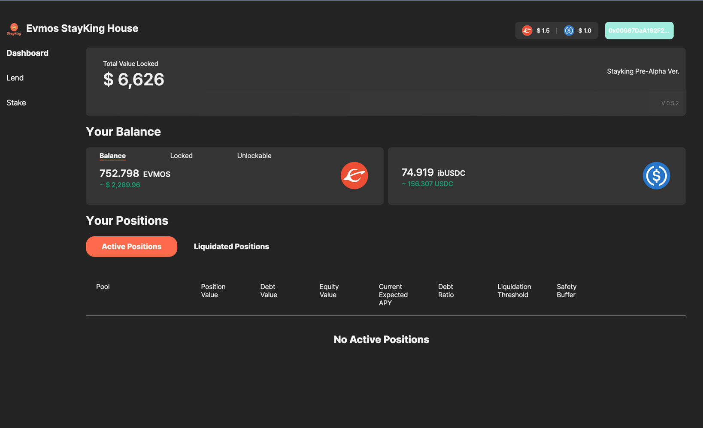

## 2022 EVMOS Hackathon StayKing House (DeFi)


EVMOS StayKing House is a decentralized finance protocol that allows stakers to maximize their yields and lenders to earn stable profit by lending their assets to stakers using leverage. We aim in creating better and wider profit – generating opportunities for all participants.


## Our Service

  https://evmos.stayking.xyz


## Test Accounts
- You can test with our service with test accounts we provided below
  - Lender ( Bob ) PK
  ```
  53242286ee73afefa2bd5522e2937b13f46a71f9fb7ab186e12d5b55818b029b
  ```
  - Staker ( Alice ) PK
  ```
  491bbf9237c55c649d41f5a105cc89e3bcba1337af236d4f681491e2061489f1
  ```
- If there is no tEVMOS or USDC token in the accounts above, please email us `gloryan@icloud.com`. we'll fill the tokens in the accounts


## Deployed the contracts on the testnet (evmos_9000-4)

```
    [mockUSDC] 0x9218b75D53612212137890354B1a16163Abb9DE3

    [MockSwap] 0x08Be1FDf4A512fc6caA7aE1Be029b922d05EA5B3

    [TripleSlopeModel] 0x739DDcC9e458bD0A88c0882aca7BB72EaFff8781

    [UnbondedEvmos] 0x20E3f88438ef008256BA40e5D265fb49ADc7fBeF

    [Stayking] 0x5c16AD45ec86A50a59b4fe7d9B205aCa2100de2f

    [Vault] 0xa6c036c12b65703Bd7C0e4F42Dc0E75f74675C64
```

## Modules

  - [stayking-finance](https://github.com/evmos-stayking-house/stayking-finance) (root) : This repo is the root repository to execute entire modules with docker-compose

    - [web-client](https://github.com/evmos-stayking-house/web-client) : This submodule repo is the web service to interact with DeFi contracts on EVMOS chain 
    - [defi-contract](https://github.com/evmos-stayking-house/defi-contract) : This submodule repo is the DeFi contracts developed by solidity language
    - [scheduled-worker](https://github.com/evmos-stayking-house/scheduled-worker) : The purpose of this repository is to run a liquidation bot every minute
    - [scheduled-worker-golang](https://github.com/evmos-stayking-house/scheduled-worker-golang) : The purpose of this repository is to subscribe to events in the Cosmos and EVMOS chains to handle certain functions such as auto compound, contract function call, etc


## Getting Started

It will copy environment variable file and initialize submodules on your machine

```sh
./init.sh
```

Docker must be pre-installed to run the script below

```sh
./start.sh
```

### Env Option
- [Local Mode]
    - Load local environment variables ( Local-Net )
    - hardhat node must be run in this mode. check submodules/defi-contract repository first
- [Dev Mode]
    - Load development environment variables ( Test-Net: evmos_9000-4 )
- [Prod Mode]
    - Not Used yet
      
- Quit

## Termination of Service

Press control + c to go to the command line and execute the command below 

```sh
./stop.sh
```

### Options

- Kill & Remove : Shutting down and deleting the currently running container
- Remove Images : End of the currently executing a container and delete. And all downloaded images deleted
- Prune : Delete all currently stopped containers, unused images, networks, volumes, and build cache
- Quit : Nothing to do

### Update to the latest source
Must be entered manually if GitHub is not set
```sh
./update.sh
```

## Folder Structure

 - **compose**
   - docker-compose configuration files

 - **data**
   - docker volume data files

 - **docker**
   - docker settings file excluding submodule

 - **docs**
   - documentation materials

 - **submodules**
    - independent service modules for each purpose

## Git Submodule management

### register git submodules

```
git submodule add -b main git@github.com:evmos-stayking-house/web-client.git submodules/web-client

git submodule add -b main git@github.com:evmos-stayking-house/scheduled-worker-golang.git submodules/scheduled-worker-golang

git submodule add -b main git@github.com:evmos-stayking-house/defi-contract.git submodules/defi-contract

git submodule add -b main git@github.com:evmos-stayking-house/scheduled-worker.git submodules/scheduled-worker
```

### unregister git submodules

```
git submodule deinit -f <path/to/submodule>

rm -rf .git/modules/<path/to/submodule>

git rm -f <path/to/submodule>
```
